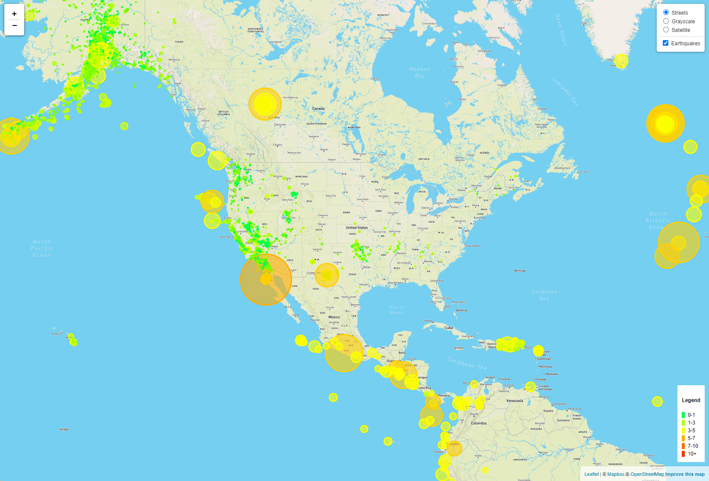

# Site
Click [Here](https://kaludii.github.io/leaflet-challenge/ "Here") To View The Earthquake Visualization Dashboard!

### Created the Earthquake Visualization

Visualized the earthquake dataset with the following steps:

1. Got my dataset with these steps:

   * Visited the [USGS GeoJSON Feed](http://earthquake.usgs.gov/earthquakes/feed/v1.0/geojson.php) page and chose a dataset to visualize, in this case Earthquakes every 30 days and copied the JSON format URL to pull in the data for the visualization.

2. Imported and visualized the data by doing the following:

   * Used Leaflet to create a map that plots all the earthquakes from the dataset based on their longitude and latitude.

       * Data markers reflect the magnitude of the earthquake by their size and the depth of the earthquake by color. Earthquakes with higher magnitudes appear larger, and earthquakes with greater depth appear darker in color.

   * Included popups that provide additional information about the earthquake when its associated marker is clicked.

   * Created a legend that will provide context for your map data.

### References

Dataset created by [the United States Geological Survey](http://earthquake.usgs.gov/earthquakes/feed/v1.0/geojson.php).
